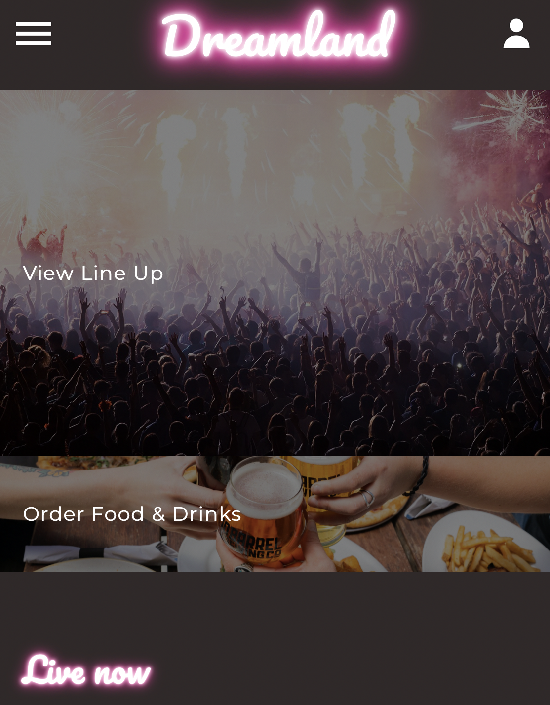
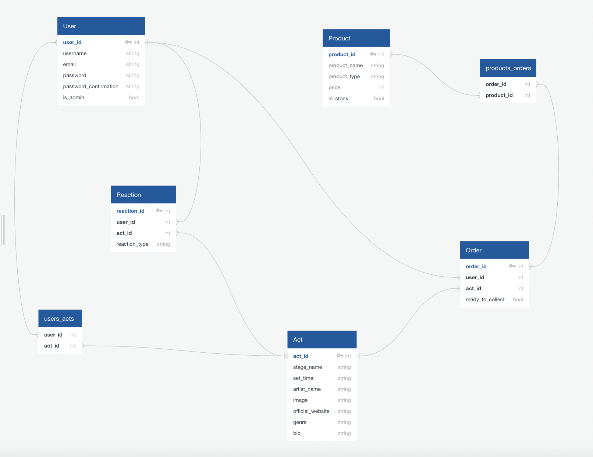
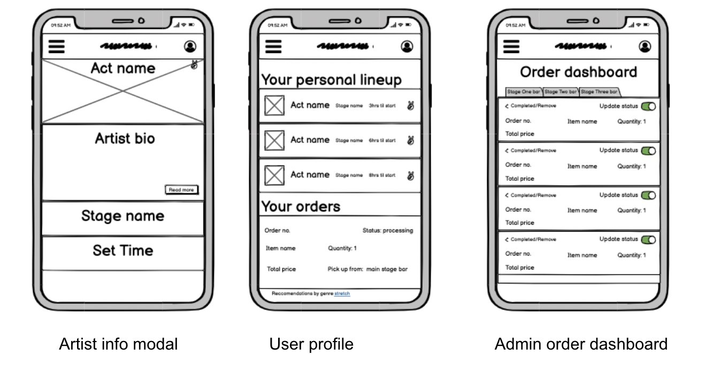

# Project 4 - Dreamland

## Overview

This was a one week project, working in a team of three to build and deploy a full-stack app.

You can see the deployed version here: [dreamlandlw.heroku.com](http://dreamlandlw.herokuapp.com/profile)

*Note: It's slow to load in Google Chrome, but it's worth the wait!*



## The Brief

* Build a full-stack application by making your own backend and your own front-end
* Use a Python Flask API using a Flask REST Framework to serve your data from a Postgres database
* Consume your API with a separate front-end built with React
* Be a complete product which most likely means multiple relationships and CRUD functionality for at least a couple of models
* Implement thoughtful user stories/wireframes that are significant enough to help you know which features are core MVP and which you can cut
* Be deployed online so it's publicly accessible.

## Technologies used

### Frontend:

* HTML5
* JavaScript (ES6)
* SASS
* Bulma
* React
* React-Router
* Webpack
* axios

### Backend:

* Python
* PostgreSQL

### Testing:

* pytest

### Other
* Github
* Git
* Heroku
* bcrypt


## Approach

### Planning

As this was the most advanced project we had faced as part of the course, we spent a long time planning to make sure we could build our site well.

We decided to build a site which is designed to be used at a festival, that should enable the user to:

* Build their personal line up.
* Order food and drinks to a location based on which act they were seeing.
* Mark orders as rady to collect, and collected (admin rights).

For this reason we chose a mobile first approach as, whilst the site works on a larger device, it's unlikely users would be accessing using these at the festival.

## Back-end

We planned out the different types of relationships within our database as you can see below:



This time spent planning meant that when it came to writing our models, it was more straightforward and clear how, and where, we should put different types of relationships.

Our order model, which has various types of relationships, looks like this:

```
from app import db
from models.base_model import BaseModel
from models.product_model import Product
from models.products_orders_model import products_orders_join


class Order(db.Model, BaseModel):
    __tablename__ = "orders"

    ready_to_collect = db.Column(db.Boolean, nullable =True)

    #relationship 1 user to many orders
    user_id = db.Column(db.Integer, db.ForeignKey("users.id", ondelete="CASCADE"))

    #relationship 1 act to many orders
    act_id = db.Column(db.Integer, db.ForeignKey("acts.id", ondelete="CASCADE"))

    #relationship many orders to many products
    products = db.relationship("Product", backref = "orders", secondary=products_orders_join)
```

We made a plan of all the things we'd like users to see/be able to do on the site. This allowed us to list the controllers we would need to write, which we then split between us to work on, creating some data to allow us to test the controllers in Insomnia. We also split the work on writing serializers, to allow us to view that information correctly.

We also created decorators for:

* Error handling
* Secure route - checking that a user has a valid token

As we had two types of users, attendee and admin, we also added extra conditions within some of the controllers. For example, only admin can delete an order so the code checks the value of the key `is_admin` to make sure they have the permission to delete. The controller for this action looks like this:

```
@router.route("/order/<int:order_id>", methods=["DELETE"])
@secure_route
def delete_an_order(order_id):
    order = Order.query.get(order_id)
    if not g.current_user.is_admin:
        return {'errors': 'You can\'t do this'}, 402
    order.remove()
    return { 'message': 'order removed successfully' }, 200
```


## Front-end

Like with the back-end we planned this out. To do this, we created wireframes of how we wanted the site to look. The final product varied slightly as we built the site, but the main features were the same.

Example of our wireframes:


We built the front-end using React and used Bulma for styling, adding adaptations to meet how we wanted the site to look.


### Features

* Personal lineup - The site enables you to add/remove acts from your personal lineup. You can browse from the line up section and then see your personal line up in the profile section. We also implemented some logic that alerts you if you are adding an act at the same time, this is done via a controller on the back-end.
* Orders - A user can create and send an order of food and drinks.
* Admin/orders - When orders are placed, these can be seen by admin on their admin page. They can be marked as ready to collect, which shows on the user profile, and then removed when collected.
* Live act/up next - On the home page you can view acts playing now or up next, this feature is updated by the current time and calculated on the front-end.
* Reactions - We also implemented a reactions feature so you could add a '❤️' to an act and it would caluclate the total number of hearts it has and show this on the home page.


##Testing

We set up several tests on the back-end using pytest, however ran out of time to write more. Here is an example test to check login:

```
def test_login():
    client = app.test_client()

    login_data = {
        "email": "bob@bob.com", 
        "password": "bobbobbob1", 
        }

    login_response = client.post(
        "api/login",
        data = json.dumps(login_data),
        content_type = "application/json"
        )

    assert len(login_response.json["token"]) != 0
```


## Improvements to make
* Fix the reactions issue. Currently these only work when you visit HTTP... and not HTTPS...
* Improve the tabs on the admin/order and food/drink pages - currently theres an issue that you can't see there is another tab.
* Improve sign up/login journey for users - when a user clicks the profile icon, it takes then to the login page. I'd like to add a link to sign in from there as they would have to click the nav bar otherwise.

## Accessibility
There are lot's of things I need to check for this, but some of the most obvious ones I need to amend are:

* Update heading elements so they are in order.
* Look at contrast issues of 'live now' and 'up next'.
* Tabbing navigation/ use of navbar menu.